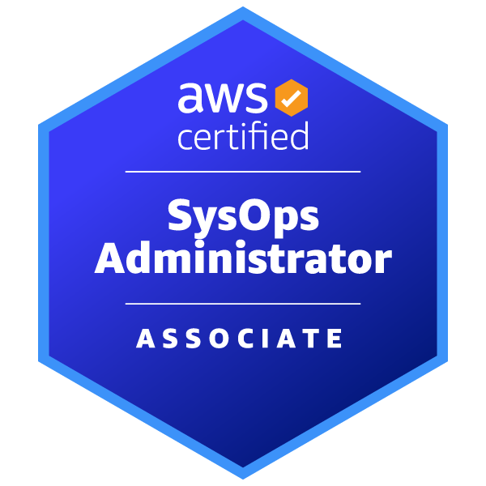
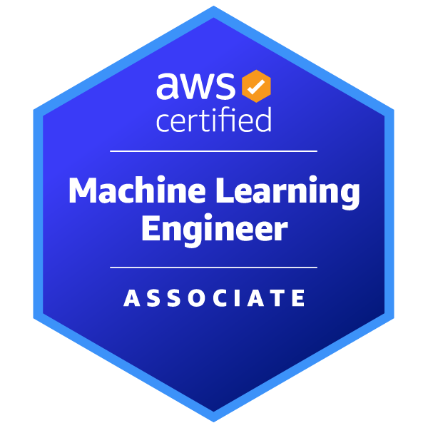
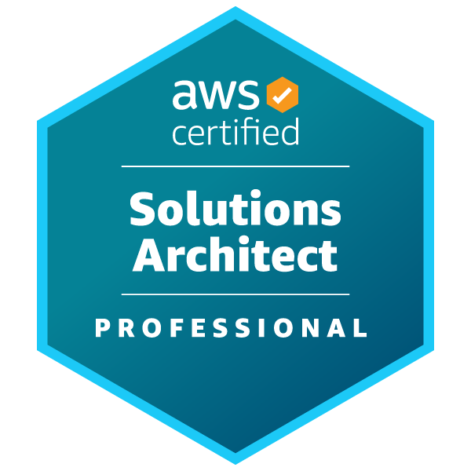
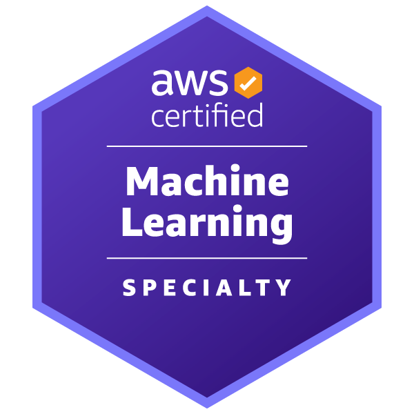
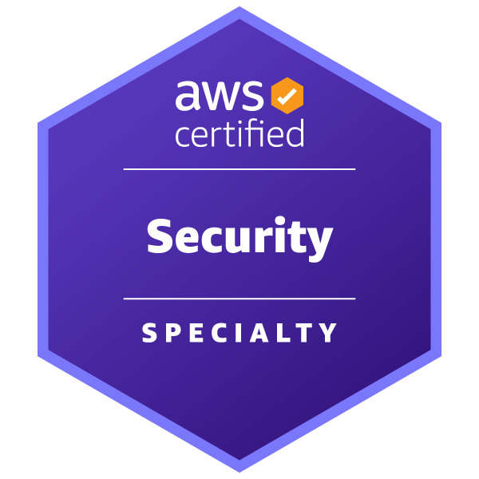
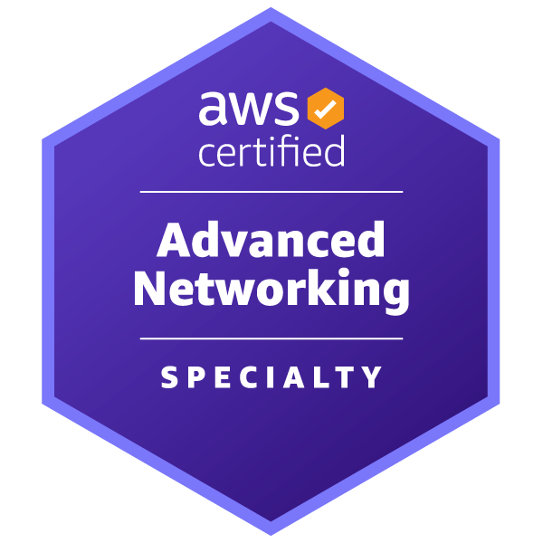

Hi  My name is Sandeep Hegde
======================================================================================================================================

AWS/Azure Cloud Professional / Job Ready Engineering Manager
-----------------------------------------------------------

AWS-Certified Technical Leader specializing in cloud infrastructure, team leadership, and operational excellence. Proven track record scaling high-performing engineering teams while architecting and delivering reliable, enterprise-grade cloud solutions on AWS and Azure.

Strategic leader skilled at translating complex business requirements into scalable technical roadmaps, fostering cross-functional collaboration, and building teams that consistently exceed performance benchmarks.

Actively seeking Engineering Manager, Delivery Manager, or AWS Solutions Architect roles where I can leverage cloud architecture expertise, team leadership experience, and strategic thinking to accelerate organizational growth and establish sustainable engineering practices.

* 🌍  I'm based in Melbourne , Australia
* ✉️  You can contact me at [sandeep.hegde@hotmail.com](mailto:sandeep.hegde@hotmail.com)
* 🧠  I'm currently learning Azure Cloud and Azure Dev Ops
* 👥  I'm looking to collaborate on Projects where I can learn to lead and work as a team
* 💬  Ask me about I'm a big fan of .........

### Socials

 <a href="https://www.github.com/sandeep-ssh" target="_blank" rel="noreferrer"> <picture> <source media="(prefers-color-scheme: dark)" srcset="https://raw.githubusercontent.com/danielcranney/readme-generator/main/public/icons/socials/github-dark.svg" /> <source media="(prefers-color-scheme: light)" srcset="https://raw.githubusercontent.com/danielcranney/readme-generator/main/public/icons/socials/github.svg" />  </picture> </a> <a href="https://www.linkedin.com/in/sandeep-s-hegde-a35854b/" target="_blank" rel="noreferrer"> <picture> <source media="(prefers-color-scheme: dark)" srcset="https://raw.githubusercontent.com/danielcranney/readme-generator/main/public/icons/socials/linkedin-dark.svg" /> <source media="(prefers-color-scheme: light)" srcset="https://raw.githubusercontent.com/danielcranney/readme-generator/main/public/icons/socials/linkedin.svg" />  </picture> </a>

### AWS Certification Badges & AWS Skill Builder Verification Link

[👉 View all my AWS badges on Skillbuilder!](https://skillsprofile.skillbuilder.aws/user/sandeep/certification-badges)

  
  
  
  
  
  
  
  
  
  
  
  

